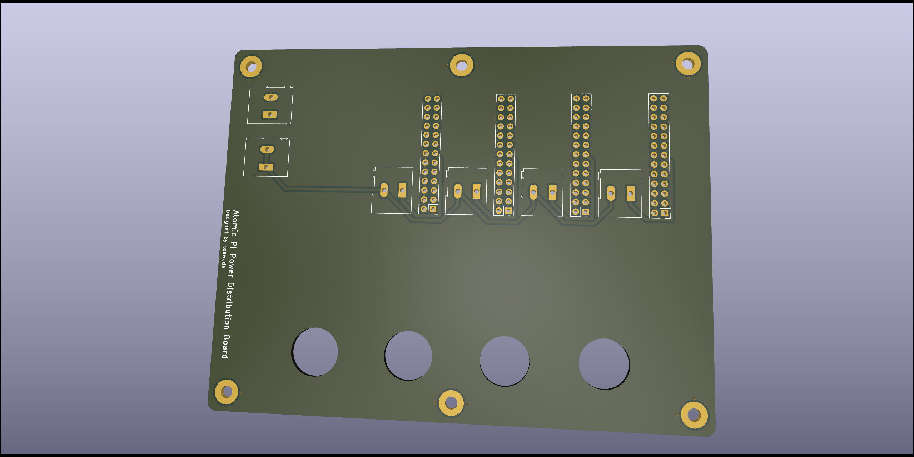

# Atomic Pi power distribution board

KiCAD schematics for a simple power distribution board to distribute power to
up to four Atomic Pi computers with individual power switches for each computer.

## Bill of materials

- 6x 5.08mm pitch screw terminal block connector
- 4x toggle switch for 0.5in hole
- 4x 2x13 2.54mm pitch headers
